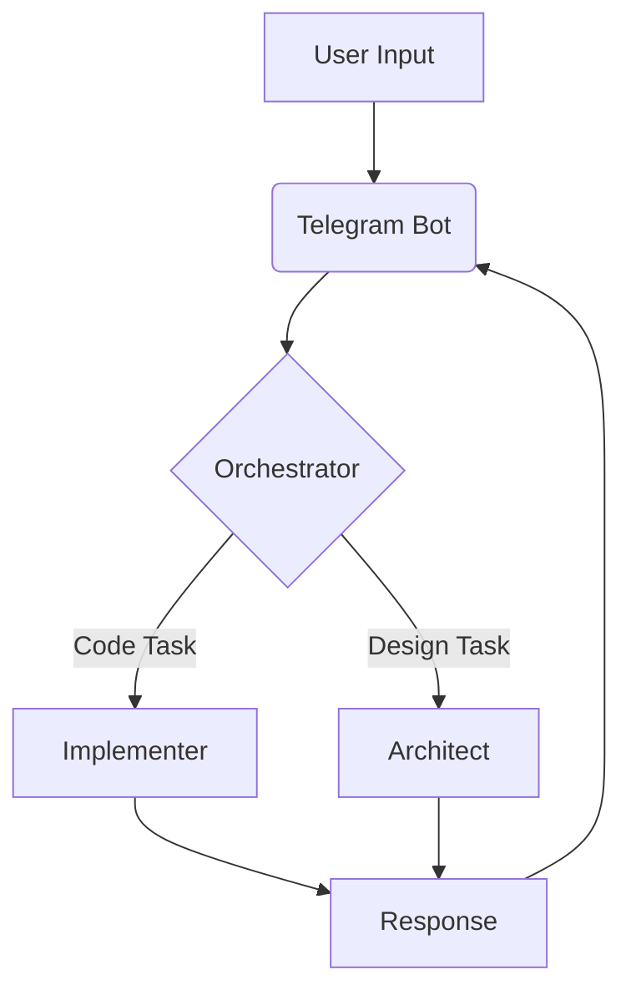

# Detailed Design Document - AI-Powered Development Assistant Bot

## 1. Architectural Overview
### 1.1 Component Diagram
```plantuml
[Telegram Bot] <--> [Orchestrator]
[Orchestrator] <--> [Architect Agent]
[Orchestrator] <--> [Implementer Agent]
[Orchestrator] <--> [Indexing Service]
[Billing System] <--> [Database]
```

### 1.2 Data Flow


## 2. Module-Level Design
### 2.1 Orchestrator Service
#### Components:
- **Task Router**: Analyzes input, selects appropriate agent
- **Context Manager**: Maintains conversation state
- **Result Aggregator**: Combines outputs from multiple agents

### 2.2 Architect Agent
#### Key Algorithms:
- Requirements parsing using LLM chain-of-thought
- Architecture decision tree for common patterns

## 3. API Specifications
### 3.1 Internal Service API
```typescript
interface TaskRequest {
  userId: string;
  taskType: 'code' | 'design' | 'debug';
  input: string;
  context: Record<string, any>;
}

interface TaskResponse {
  success: boolean;
  output: string;
  creditsUsed: number;
}