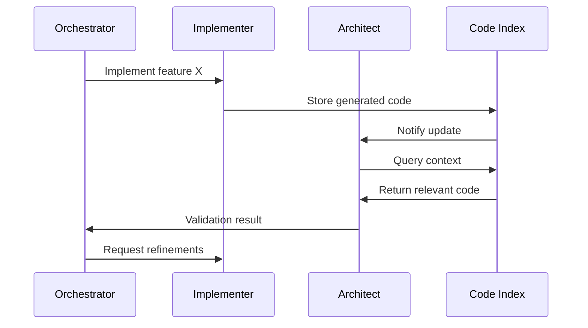

# Detailed Design Document - AI-Powered Development Assistant Bot

## 1. Architectural Overview
[Existing content remains unchanged]

## 2. Module-Level Design
### 2.1 Implementer Agent
#### Key Algorithms:
- Code generation using OpenAI API with temperature=0.7
- Validation via AST parsing and flake8
- Complexity scoring using cyclomatic metrics

### 2.2 Codebase Indexing Service
#### Key Algorithms:
- Vectorization using SentenceBERT via Hugging Face Transformers
- Hybrid search combining semantic and keyword matching

## 3. Enhanced Sequence Diagrams
### 3.1 Iterative Implementation-Verification


## 4. Complete Data Dictionary
### 4.1 Table: api_keys
- **key_id** (PK, UUID): Unique identifier
- **user_id** (FK): Associated user
- **key_value** (TEXT): Encrypted API key
- **is_active** (BOOLEAN): Key status

### 4.2 Table: credit_transactions
- **tx_id** (PK, UUID): Transaction ID
- **user_id** (FK): Associated user
- **amount** (DECIMAL): Credit change
- **description** (TEXT): Operation reason

## 5. API Contracts
### 5.1 Orchestrator -> Architect
```typescript
interface DesignTask {
  requirements: string;
  context: Record<string, any>;
}

interface DesignResponse {
  architecture: string;
  components: string[];
  creditsUsed: number;
}