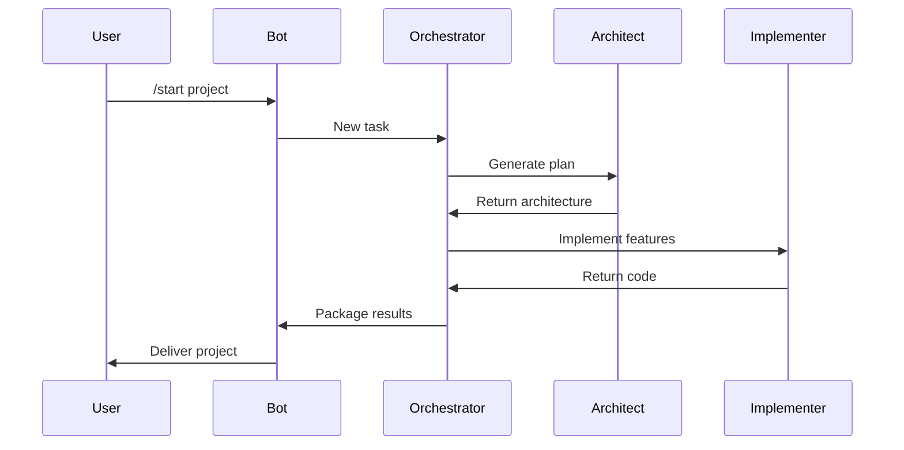
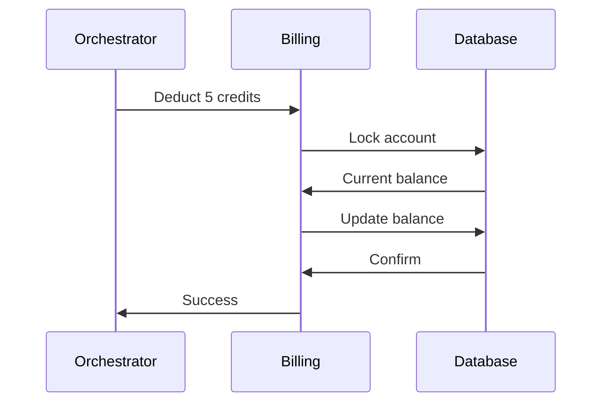

# Detailed Design Document - AI-Powered Development Assistant Bot

## 1. Architectural Overview
[Existing content remains unchanged]

## 2. Module-Level Design
### 2.1 Orchestrator Service
[Existing content remains unchanged]

### 2.2 Implementer Agent
#### Components:
- **Code Generator**: Uses LLM to produce Python code
- **Linter**: Validates generated code against flake8
- **Test Generator**: Creates basic pytest cases
- **Docstring Injector**: Adds Google-style docstrings

#### Key Algorithms:
- Prompt chaining for multi-file generation
- Code validation using AST parsing
- Complexity scoring for task estimation

### 2.3 Codebase Indexing Service
#### Components:
- **File Parser**: Extracts code definitions
- **Vectorizer**: Creates embeddings using SentenceBERT
- **Query Engine**: Handles semantic searches

#### Key Algorithms:
- Chunking strategy for large files
- Hybrid search (semantic + keyword)
- Cache invalidation policy

### 2.4 Billing System
#### Components:
- **Credit Manager**: Tracks balances
- **Transaction Logger**: Records all deductions
- **Report Generator**: Creates usage reports

#### Key Algorithms:
- Atomic credit operations
- Fraud detection heuristics
- Prorated refund calculations

## 3. Sequence Diagrams
### 3.1 Project Generation


### 3.2 Credit Deduction


## 4. Database Design
### 4.1 Data Dictionary
#### Table: users
- **user_id** (PK, UUID): Unique user identifier
- **credits** (DECIMAL(9,3)): Available balance
- **last_active** (TIMESTAMP): Final interaction time

#### Table: transactions
- **tx_id** (PK, UUID): Transaction ID  
- **user_id** (FK): Associated user
- **amount** (DECIMAL(9,3)): Credit delta
- **description** (TEXT): Operation reason

## 5. API Specifications
### 5.1 Orchestrator -> Implementer
```typescript
interface CodeTask {
  requirements: string;
  context: Record<string, any>;
  creditsAvailable: number;
}

interface CodeResponse {
  files: Array<{
    path: string;
    content: string;
    checksum: string;
  }>;
  warnings: string[];
  creditsUsed: number;
}